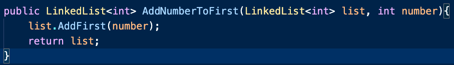
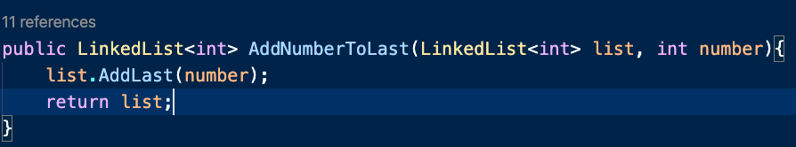
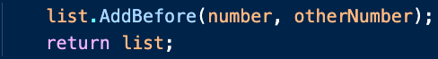
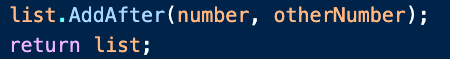
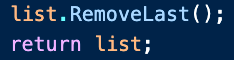
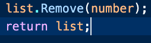

# Introduction: Linked Lists #

## **Content**:

I. Linked lists
   * Imagine you have a chain. Each link of the chain is hooked to the link before it and the link after it. That is pretty much how linked lists are. As you can see from the image above, each 'node' has a pointer to the next 'node' normally, they also have a pointer to the previous node as well. This keeps the list in order and keeps things in check. Linked Lists are very useful because of their performance. Linked lists always operate at O(1) because the number of things you have to change in the list is always the same. All you have to do is change the pointers to the correct node you would like and then you are done!   

II. Linked List functions
   * Luckily just like Stacks we have a class already implemented for Linked Lists in C#. The operations for Linked Lists are AddAfter(), AddBefore(), AddFirst(), AddLast(), RemoveLast(), RemoveFirst() and Remove(). Each of these operate at 0(1).

   1. AddFirst()
        * We use AddFirst() to add a node to the first position in the list.
        

   2. AddLast()
        * We use AddLast() to add something to the end of the list.

   3. LinkedListNode<T> node = new LinkedlistNode<T>
        * This operation is used to create a new node. This will be used for the next two operations.

   4. AddBefore()
        * AddBefore() takes two parameter. The node you would like to add and what you would like to add it before. Both of these need to be of type LinkedListNode<T>, not the type of data those nodes contain however like int or string.

   5. AddAfter()
        * AddAfter() does the same thing as AddBefore() except it places the node after the specified node in the list instead of before it.

   6. RemoveFirst()
        * RemoveFirst() removes the first node found in the list.

   7. RemoveLast()
        * RemoveLast() removes the last node found in the list.

   8. Remove()
        * Remove() removes the node that is specified in the list.

 

