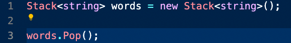
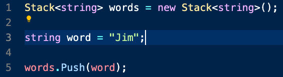

# Inrtoduction: Stacks #

## **Content**:

I. Stack of Pancakes
   * If you were going to make pancakes for your family or friends, you probably would have a plate ready to stack the hot pancakes on as they finished cooking. Each time we put a pancake onto the stack, we call this a push operation. In our culinary example, we might say that each new pancake goes onto the top of the stack. However, since we are going to implement our stacks in Python, we will say that the pancake is actually added to the back. When we take a pancake off to eat, we call this a pop operation. Notice that we push and pop from the back of the stack. Removing from the middle of the stack is not generally allowed (especially at the dinner table). Notice that the pancake at the front is the very first pancake that was cooked. If the pancakes are made faster than they are eaten, then this first pancake would get cold. A LIFO (Last In, First Out) structure like the stack can result in data not being used for a long time. This might not work well for a rotating stock system in a grocery store, but the real benefit of the stack is the ability to remember where we have been.

II. Stack functions
   * Luckily in C# the framework includes the Stack class. This means these functions are already in the language that we can just implement. There are also a few other functions that we will talk about in this lesson that will help us to better use C#.

   1. Pop()
        * We use Pop() to remove the last item that was added to the Stack, remember LIFO, last in first out.

        * Pop() is O(1) because we are only every going to pop the last element in the Stack().
        

   2. Push()
        * We use Push() to add something to the end of the list.

        * Push() is also going to be O(1) because it only pushes one element onto the end of the Stack.

